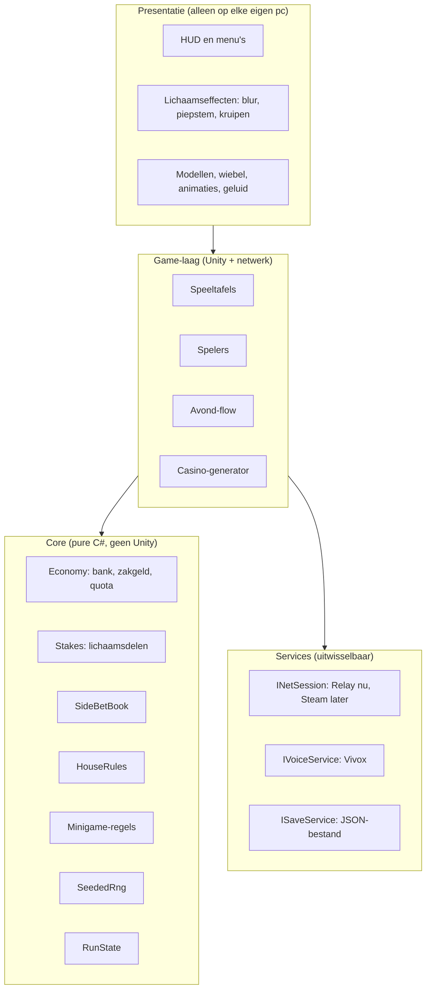
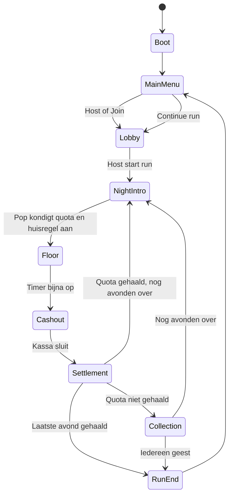

# Skin in the Game — Architectuur en MVP-specificatie

## Samenvatting

Skin in the Game is een first-person co-op casinogame voor 2 tot 4 vrienden. Je gokt niet alleen met geld maar ook met je lichaamsdelen: verlies je stem, ogen, handen of benen en speel verder met een piepstem, wazig zicht, zonder grip of kruipend. Een run duurt ongeveer 30 minuten, verdeeld over vijf avonden in een telkens nieuw gegenereerd casino. Tegenstander is "het huis": een eng-grappige pop die elke avond het quota int.

Deze specificatie beschrijft een architectuur die klein begint (hosten op je eigen laptop, gratis tools) en kan doorgroeien naar een Steam-release zonder dat je de game hoeft te herschrijven. Hij is geschreven voor iemand zonder programmeerervaring die de code laat schrijven door Claude Code, in kleine stappen van één of twee avonden.

## Doelen en succescriteria

- Een speelbare MVP waarin 4 vrienden vanaf thuis via een joincode samen een volledige run van 5 avonden spelen.
- Proximity voice chat werkt vanaf de eerste multiplayer-versie, inclusief stemeffecten bij het verliezen van je stem.
- Elke bouwstap is binnen één of twee avonden af te ronden en direct te testen.
- Spelregels (geld, inzetten, minigames) zijn automatisch te testen zonder Unity te starten.
- Later overstappen naar Steam vraagt alleen een nieuwe netwerk-module, geen herschrijving.
- Succes in de praktijk: je vrienden vragen na de eerste test of ze nog een run mogen doen.

## Genomen beslissingen

| Onderwerp | Keuze |
|---|---|
| Engine | Unity 6 LTS (C#), Universal Render Pipeline |
| Perspectief | First person, met third-person camera op dramatische momenten |
| Personages | Wiebelige figuren: normaal lopen, slap bij vallen, klappen en gedragen worden |
| Spelers | 2 tot 4 per lobby |
| Platform | Alleen PC. MVP hosten op eigen laptop, Steam later |
| Verbinden | Online via joincode (relay, geen poorten openzetten) |
| Voice chat | Proximity voice vanaf de eerste multiplayer-versie |
| Budget | €0, alleen gratis tools en assets |
| Casino | Elke avond nieuw gegenereerd uit kamer-bouwblokken |
| Geld | Teambank plus eigen zakgeld per speler |
| Fysiek geld | Getal op scherm, grote winsten als fysieke zak geld |
| Lichaamsdelen in MVP | Stem, ogen, handen, benen |
| Minigames (bouwvolgorde) | 1 Hoger of lager, 2 Blackjack, 3 Menselijke roulette, 4 Menselijke pachinko |
| Extra systemen in MVP | Zijweddenschappen, willekeurige huisregels per avond |
| Later | Pit Boss en valsspelen, pandjeshuis met charms |
| Alle lichaamsdelen kwijt | Je wordt een geest die kan kijken en wedden. Geen bloed, nergens |
| Einde run | Vast aantal avonden (5), dan een einde |
| Bewaard tussen runs | Cosmetica (hoedjes, kleuren) |
| Verbinding kwijt (speler) | Opnieuw joinen midden in de avond, met behoud van alles |
| Verbinding kwijt (host) | Run wordt bewaard aan het begin van elke avond, host kan hervatten |
| Het huis | Een pop, eng-grappig, geen horror |
| Runduur | Ongeveer 30 minuten |
| Taal | Alleen Engels in de game |
| Modellen | Eerst simpele blokken, daarna gratis CC0-modellen met PS1-filter |
| Bouwen | Claude Code schrijft de code, jij stuurt en test |
| Tijd | Een paar uur per week |

## Scope

**In de MVP:** lobby met joincode, proximity voice, 5 avonden per run, gegenereerd casino, teambank en zakgeld, vier lichaamsdelen als inzet, geestmodus, minigames Hoger of lager en Blackjack, zijweddenschappen, 3 tot 5 huisregels, geldzakken en kassa, opslaan en hervatten, opnieuw joinen, cosmetica.

**Na de MVP:** menselijke roulette, menselijke pachinko, Pit Boss en valsspelen, pandjeshuis met charms, Steam-integratie, meer lichaamsdelen (oren, gezicht), meerdere eindes.

**Buiten scope:** echt geld, microtransacties, lootboxen, dedicated servers, consoles, andere talen dan Engels, bloed of gore.

## Gratis techniek

| Onderdeel | Tool | Waarom |
|---|---|---|
| Engine | Unity 6 LTS, Personal-licentie | Gratis tot een flinke omzetgrens, standaard voor friendslop |
| Netwerk | Netcode for GameObjects (NGO) | Officieel van Unity, veel documentatie, goed voor Claude Code |
| Transport | Unity Transport | Werkt samen met Relay, later vervangbaar door Steam |
| Inloggen | Unity Authentication, anoniem | Geeft elke speler een vaste ID voor opnieuw joinen, zonder account |
| Joincode | Unity Relay | Laptop host, vrienden joinen met code, geen routerinstellingen |
| Voice chat | Vivox | Gratis tier, stemmen kunnen door Unity-audio worden geleid voor effecten |
| Invoer | Unity Input System | Toetsenbord, muis en controller |
| Camera | Cinemachine | First person plus dramatische camerashots |
| Testen met meerdere spelers | Multiplayer Play Mode | Tot 4 spelers tegelijk op je eigen laptop in de editor |
| Automatisch testen | Unity Test Framework | Spelregels testen zonder te spelen |
| Code-editor | VS Code met C# Dev Kit, of Visual Studio Community | Gratis |
| Versiebeheer | Git, GitHub, Git LFS | Back-up van elke werkende stap, terug kunnen als iets stukgaat |
| Modellen | Kenney, Quaternius (CC0) | Gratis en vrij te gebruiken, ook commercieel |

Controleer bij de start de actuele gratis limieten van Relay en Vivox op de site van Unity. Voor een MVP met een handvol testers zit je er ruim onder.

## Architectuur in lagen

De belangrijkste regel: **spelregels weten niets van Unity.** Alles wat bepaalt wie wint, hoeveel geld er is en welk lichaamsdeel weg is, zit in gewone C#-code die je automatisch kunt testen. Unity-onderdelen zijn alleen de "handen en ogen" eromheen.



Afhankelijkheden lopen alleen naar binnen. Core kent niemand. Game kent Core en Services. Presentatie kent Game. Zo kan Claude Code een onderdeel aanpassen zonder de rest te breken.

### Laag 1: Core (pure C#)

Bevat alle spelregels en de volledige toestand van een run. Geen `MonoBehaviour`, geen `UnityEngine`. In Unity krijgt deze map een eigen assembly met "No Engine References" aan, zodat het technisch onmogelijk is om er per ongeluk Unity-code in te zetten.

Onderdelen:

- `RunState`: de complete toestand van een run. Dit is wat wordt opgeslagen en hervat.
- `EconomyService`: teambank, zakgeld, quota per avond, uitbetalingen.
- `StakeService`: lichaamsdelen inzetten, verliezen, terugwinnen, geest worden.
- `SideBetBook`: weddenschappen op een ronde van een andere speler.
- `HouseRuleSet`: de regels van de huidige avond, als modifiers op uitbetalingen en tijd.
- `Minigames/`: per spel alleen de regels, bijvoorbeeld `HigherLowerGame`, `BlackjackGame`.
- `SeededRng`: eigen randomgenerator met seed. Gebruik nooit `UnityEngine.Random` voor spellogica, want die is niet reproduceerbaar.
- `GameBalance`: alle getallen (quota, startbank, waarde van lichaamsdelen) op één plek.

### Laag 2: Game (Unity + netwerk)

De brug tussen spelregels en de wereld. Alleen de host voert Core-code uit; clients vragen dingen aan en tonen het resultaat.

- `NightFlowController`: de state machine van een run (zie hieronder).
- `CasinoGenerator`: bouwt het casino uit een seed.
- `TableBehaviour`: een speeltafel in de wereld die een Core-minigame vasthoudt.
- `PlayerAvatar`: beweging, interactie, dragen en gedragen worden.
- `MoneyBag`: fysieke zak geld die je naar de kassa draagt.
- `CashierDesk`: de kassa waar geld de teambank in gaat.

### Laag 3: Presentatie

Alles wat je ziet en hoort, per pc lokaal. Wordt nooit gesynchroniseerd, maar reageert op gesynchroniseerde toestand. Voorbeelden: de blur als je ogen weg zijn, de wiebel van personages, de HUD, de pop die het quota aankondigt.

### Laag 4: Services

Dingen die van buiten komen, achter een interface zodat je ze kunt vervangen:

- `INetSession`: `HostAsync()` geeft een joincode terug, `JoinAsync(code)` verbindt. MVP-versie gebruikt Relay. Later komt er een Steam-versie naast, zonder dat de game het merkt.
- `IVoiceService`: inloggen bij voice, kanaal joinen, per speler een geluidsbron leveren.
- `ISaveService`: run en profiel opslaan en laden.

## Wie beslist wat (autoriteit)

| Wat | Wie beslist | Waarom |
|---|---|---|
| Geld, inzetten, uitkomsten, lichaamsdelen | Host | Iedereen moet exact hetzelfde zien, geen ruzie over wie won |
| Timer, avond-flow, huisregels | Host | Eén bron van waarheid |
| Lopen en rondkijken | De speler zelf | Voelt direct en soepel, valsspelen is geen probleem onder vrienden |
| Slap worden (ragdoll) aan of uit | Host | Anders valt iemand bij de een wel en bij de ander niet om |
| Wiebelen, animaties, effecten | Elke pc zelf | Puur visueel, hoeft niet exact gelijk |

Clients sturen alleen **verzoeken** naar de host: "ik wil 200 inzetten", "ik kies hoger", "ik wed dat Daan verliest". De host controleert of het mag, voert het uit in Core, en stuurt het resultaat terug. Een client verandert nooit zelf de teambank.

## Avond-flow (state machine)



Richtlijn voor 30 minuten: 5 avonden van elk ongeveer 5 minuten op de vloer, met intro, afrekening en overgang samen rond de 1 minuut. Het opslaan gebeurt automatisch aan het begin van elke `NightIntro`.

Elke state is een klein los bestand met `Enter`, `Tick` en `Exit`. Alleen de host wisselt van state en laat dat aan iedereen weten.

## Datamodel

```csharp
// Core: alles wat nodig is om een run op te slaan en te hervatten
public sealed class RunState {
    public int Seed;
    public int NightIndex;              // 0 t/m 4
    public long TeamBank;
    public long[] QuotaPerNight;
    public string[] HouseRuleIdsPerNight;
    public Dictionary<PlayerKey, PlayerState> Players;
}

public sealed class PlayerState {
    public PlayerKey Key;               // vaste ID uit Unity Authentication
    public string DisplayName;
    public long PocketMoney;
    public BodyParts Parts;             // welke delen je nog hebt
    public bool IsGhost => Parts == BodyParts.None;
    public CosmeticLoadout Cosmetics;
    public bool IsConnected;            // niet opgeslagen, alleen tijdens spelen
}

[Flags]
public enum BodyParts { None = 0, Voice = 1, Eyes = 2, Hands = 4, Legs = 8, All = 15 }

public readonly record struct Stake(long Money, BodyParts Part);
```

`PlayerKey` is de vaste ID die de speler krijgt van Unity Authentication. Daardoor herkent de host iemand die opnieuw joint en krijgt die speler zijn lichaamsdelen en zakgeld terug.

## Wat wordt gesynchroniseerd

| Gegeven | Hoe | Wie schrijft |
|---|---|---|
| Teambank, quota, avondnummer, huisregel | Netwerkvariabelen op een `RunSync`-object | Host |
| Timer | Eindtijd als netwerkvariabele, elke pc telt zelf af | Host |
| Per speler: zakgeld, lichaamsdelen, geest, cosmetica | Netwerkvariabelen op de speler | Host |
| Positie en kijkrichting speler | Netwerk-transform, eigenaar is de speler | Speler zelf |
| Ragdoll aan of uit | Netwerkvariabele op de speler | Host |
| Ragdoll-positie | Alleen het bekken wordt gesynchroniseerd, ledematen simuleert elke pc zelf | Host |
| Casino-indeling | Alleen de seed | Host |
| Speeltafels en geldzakken | Netwerkobjecten, gespawnd door host na generatie | Host |
| Minigame-uitkomst | Bericht van host naar iedereen, met uitkomst | Host |
| Animaties van uitkomst | Elke pc speelt zelf af richting de uitkomst | Elke pc |

## Casino-generator

- Kamers zijn losse prefabs (bouwblokken) met deuropeningen als koppelpunten: lobby, tafelzaal, gang, kassa, toiletten, kantoor van de pop.
- Uit de seed kiest `CasinoGenerator` welke kamers aan elkaar komen. Elke pc bouwt de muren en vloeren zelf, dus alleen de seed gaat over het netwerk.
- Na het bouwen spawnt alleen de host de interactieve dingen (tafels, geldzakken) op plekken die de generator heeft aangewezen.
- De kassa staat altijd een eind van de meeste tafels, zodat geld wegbrengen spannend is.
- Regel: de generator gebruikt alleen `SeededRng`, zodat dezelfde seed altijd hetzelfde casino geeft. Dat maakt bugs reproduceerbaar.

## Lichaamsdelen als modifiers

Elk lichaamsdeel is een losse modifier die op precies één systeem inhaakt. Ze reageren op de gesynchroniseerde `Parts` van een speler.

| Deel | Modifier | Haakt in op | Effect |
|---|---|---|---|
| Stem | `VoiceModifier` | Voice-audio bij de luisteraar | Piepstem via audiomixer, of stil |
| Ogen | `VisionModifier` | Eigen camera | Blur en zwart-wit, alleen op je eigen scherm |
| Handen | `HandsModifier` | Interactiesysteem | Oppakken geblokkeerd, knoppen alleen met je hoofd |
| Benen | `LegsModifier` | Beweging | Kruipen, laag tempo, andere spelers kunnen je optillen |

Stemeffect technisch: Vivox levert per speler een Unity-geluidsbron (een "participant tap"). Die hang je aan het hoofd van zijn personage voor 3D-geluid en leid je door een audiomixer. Elke luisteraar ziet dat de spreker zijn stem kwijt is en zet het effect aan bij zichzelf. De microfoon van de spreker zelf wordt niet aangepast.

Iemand dragen: een speler zonder benen wordt oppakbaar. De drager maakt op de host een fysieke koppeling, en de gedragen speler gaat in ragdoll.

## Minigames

Elke minigame bestaat uit twee delen: regels in Core en een tafel in de wereld.

```csharp
// Core
public interface IMinigame {
    string Id { get; }
    MinigamePhase Phase { get; }                 // Waiting, Betting, Playing, Resolved
    bool CanJoin(PlayerKey p, PlayerState s);
    void PlaceStake(PlayerKey p, Stake stake);
    void ApplyAction(PlayerKey p, MinigameAction action);
    RoundOutcome Resolve(SeededRng rng, HouseRuleSet rules);
    event Action<RoundOpened> RoundOpened;       // SideBetBook luistert hiernaar
    event Action<RoundOutcome> RoundResolved;    // Economy en StakeService luisteren
}
```

`HigherLowerGame` is de eerste en simpelste: een kaart ligt open, speler kiest hoger of lager, winst verdubbelt, doorgaan of stoppen. Geschikt om het hele systeem mee te testen voordat Blackjack komt.

`TableBehaviour` in de game-laag doet niets anders dan verzoeken van spelers doorgeven aan het Core-spel op de host en het resultaat laten zien.

## Zijweddenschappen

- Zodra een ronde aan een tafel opent, verschijnt boven de tafel een bord met de wedvraag, bijvoorbeeld "Will Daan win this round?".
- Andere spelers en geesten hebben een paar seconden om in te zetten met hun zakgeld.
- `SideBetBook` in Core houdt inzetten bij en rekent uit na `RoundResolved`.
- Uitbetaling gaat altijd naar zakgeld, nooit naar de teambank.
- Geesten wedden mee met een klein vast bedrag per avond, zodat ze betrokken blijven.

## Huisregels

Een huisregel is een data-asset met een paar knoppen, zodat je nieuwe regels maakt zonder code:

```csharp
public sealed class HouseRuleDefinition {       // ScriptableObject in Unity
    public string Id;
    public string AnnouncementText;             // wat de pop zegt, in het Engels
    public float PayoutMultiplier = 1f;
    public float FloorTimeMultiplier = 1f;
    public float BlackoutIntervalSeconds = 0f;  // 0 = geen stroomuitval
    public float QuotaMultiplier = 1f;
}
```

Start met vier regels: dubbele winst maar hoger quota, elke minuut een stroomuitval, minder tijd maar lager quota, en een rustige eerste avond zonder regel.

## Opslaan, hervatten en opnieuw joinen

- **Run opslaan:** aan het begin van elke avond schrijft de host `RunState` als JSON-bestand naar de opslagmap van de game.
- **Hervatten:** in het hoofdmenu verschijnt "Continue run" als er een opgeslagen run is. De host start een lobby, vrienden joinen, en elke speler krijgt op basis van zijn `PlayerKey` zijn plek terug. Wie niet komt opdagen, krijgt zijn plek terug als hij later alsnog joint.
- **Speler valt weg:** de host zet `IsConnected` op false en houdt alle gegevens vast. Het personage valt slap op de grond. Joint hij opnieuw met dezelfde ID, dan staat hij op met alles wat hij had.
- **Cosmetica:** een klein profielbestand per speler op zijn eigen pc. Bij het joinen stuurt hij zijn keuze naar de host, die het aan iedereen doorgeeft. Later kan dit naar Steam Cloud.

## Voice chat

- Eén Vivox-kanaal per lobby.
- Per speler een participant tap aan het hoofd van zijn personage, met Unity-3D-geluid voor proximity: hoe verder weg, hoe zachter.
- Stemeffecten via een audiomixer-groep per lichaamstoestand.
- Geesten klinken met veel galm. Of levende spelers geesten kunnen horen, staat bij de open vragen.

## Projectstructuur

```
Assets/_Project/
  Scripts/
    Core/            SITG.Core.asmdef (geen Unity)
      Economy/  Stakes/  SideBets/  HouseRules/  Minigames/  Run/  Random/
    Game/            SITG.Game.asmdef
      Flow/  Casino/  Tables/  Player/  Money/
    Presentation/    SITG.Presentation.asmdef
      UI/  BodyFx/  Audio/  Camera/
    Services/        SITG.Services.asmdef
      Net/  Voice/  Save/
  Tests/
    EditMode/        SITG.Tests.asmdef (test Core)
  Data/              Balance, HouseRules, Cosmetics (ScriptableObjects)
  Prefabs/           Rooms, Tables, Player, MoneyBag
  Scenes/            Boot, MainMenu, Casino
  Art/  Audio/
CLAUDE.md
```

## Werken met Claude Code

- Zet het bijgeleverde `CLAUDE.md` in de hoofdmap van je Unity-project. Claude Code leest dat bestand bij elke sessie.
- Eén bouwstap per sessie. Begin je sessie met: "We gaan aan stap X uit SPEC-architectuur.md werken."
- Laat Claude Code bij elke Core-wijziging ook tests schrijven en draaien.
- Jij test daarna in Unity: druk op Play, en voor multiplayer gebruik je Multiplayer Play Mode met 2 tot 4 spelers.
- Werkt het? Laat Claude Code een commit maken en naar GitHub pushen. Werkt het niet? Beschrijf precies wat je zag en plak de foutmelding uit de Unity Console.
- Unity-dingen die je met de muis doet (scenes, prefabs koppelen) doe je zelf. Vraag Claude Code om een stappenlijst voor wat je in de editor moet klikken.

## Bouwvolgorde

Elke stap is bedoeld voor één of twee avonden en eindigt met iets dat je kunt zien of testen. Met een paar uur per week is de MVP realistisch in 6 tot 9 maanden.

1. **Opzet.** Unity Hub, Unity 6 LTS, VS Code, Git, GitHub-repo, Claude Code, lege projectstructuur met de assemblies. Klaar als: project opent zonder fouten en staat op GitHub.
2. **Rondlopen.** First-person speler in een grijze kamer van blokken. Klaar als: je kunt lopen, springen en rondkijken.
3. **Hoger of lager, alleen regels.** `HigherLowerGame` en `SeededRng` in Core, met tests. Klaar als: alle tests groen.
4. **Eerste tafel.** Tafel in de kamer, singleplayer, bank en quota op het scherm, timer van 5 minuten. Klaar als: je kunt spelen en geld winnen of verliezen.
5. **Een hele run, alleen.** State machine met 5 avonden, afrekenen en einde. Klaar als: je een run van begin tot eind speelt.
6. **Samen in de kamer.** Relay en joincode, twee spelers zien elkaar lopen. Klaar als: werkt in Multiplayer Play Mode, daarna met één vriend online.
7. **Samen gokken.** Tafel over het netwerk, teambank en zakgeld gesynchroniseerd. Klaar als: beide spelers zien dezelfde uitkomst en hetzelfde saldo.
8. **Voice chat.** Vivox met proximity. Klaar als: vriend klinkt zachter als hij wegloopt.
9. **Benen en ogen.** Eerste twee lichaamsdelen als inzet. Klaar als: kruipen en wazig zicht werken voor iedereen.
10. **Handen en stem.** Oppakken blokkeren, piepstem en stil. Klaar als: je vriend klinkt als een eekhoorn.
11. **Dragen.** Spelers zonder benen optillen, ragdoll aan en uit. Klaar als: je een vriend naar de kassa kunt sjouwen.
12. **Geesten.** Alle delen kwijt is geestmodus. Klaar als: geest kan rondzweven en kijken.
13. **Zijweddenschappen.** Klaar als: je op de ronde van een vriend kunt wedden en uitbetaald krijgt.
14. **Gegenereerd casino.** Kamerblokken en generator. Klaar als: elke avond ziet er anders uit, voor iedereen gelijk.
15. **Huisregels.** Vier regels als data. Klaar als: de pop-tekst een regel aankondigt en die werkt.
16. **Geldzakken en kassa.** Grote winst als zak, naar de kassa dragen. Klaar als: laten vallen en oprapen werkt.
17. **Blackjack.** Tweede minigame. Klaar als: speelbaar met twee spelers aan één tafel.
18. **Opslaan en hervatten, opnieuw joinen.** Klaar als: host sluit af, start opnieuw, en jullie gaan verder bij het begin van de avond.
19. **Cosmetica.** Hoedjes en kleuren vrijspelen en tonen. Klaar als: vrienden zien jouw hoed.
20. **Aankleding.** Blokken vervangen door CC0-modellen, PS1-filter, de pop, geluid. Klaar als: het lijkt op de moodboard.
21. **Speeltest.** Vier vrienden, een volledige run, aantekeningen maken.

## Risico's

- **Netwerk is het moeilijkste deel.** Daarom komt multiplayer in stap 6, vroeg genoeg om problemen te ontdekken maar pas na een werkende singleplayer-loop.
- **Physics over het netwerk.** Beperkt door alleen het bekken te synchroniseren en de rest per pc te laten wiebelen. Kleine verschillen tussen schermen zijn acceptabel en vaak juist grappig.
- **Scope groeit.** Alles wat niet in de MVP-lijst staat, gaat op een "later"-lijst. Niet tussendoor bouwen.
- **Stemeffecten met Vivox.** Moet vroeg getest worden in stap 10. Valt het tegen, dan kan het stemverlies ook met alleen stil of volume omlaag.
- **Unity-versies.** Leg de Unity-versie vast in `CLAUDE.md` en update niet halverwege zonder reden.
- **Gratis limieten.** Relay en Vivox hebben gratis tiers. Controleer ze vóór een publieke release.

## Open vragen en aannames

- Kunnen levende spelers geesten horen? Aanname: ja, als gefluister met galm.
- Precieze quota, startbank en waarde van elk lichaamsdeel. Aanname: alles in `GameBalance`, afstemmen na de eerste speeltest.
- Wat neemt het huis als het quota niet gehaald wordt? Aanname: van elke speler één willekeurig lichaamsdeel.
- Hoe je een lichaamsdeel terugwint zonder pandjeshuis. Aanname: winnen met een lichaamsdeel als inzet geeft een verloren deel terug.
- Naam, stem en uiterlijk van de pop.
- Wanneer de Steam-pagina online gaat. Advies: zodra stap 11 werkt, want dan heb je grappige clips.

## Volgende stappen

1. Installeer Unity Hub en de nieuwste Unity 6 LTS, plus Git en VS Code.
2. Maak een lege GitHub-repository `skin-in-the-game`.
3. Installeer Claude Code en zet `CLAUDE.md` en dit bestand in de projectmap.
4. Start stap 1 met Claude Code.
